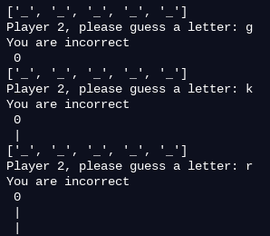
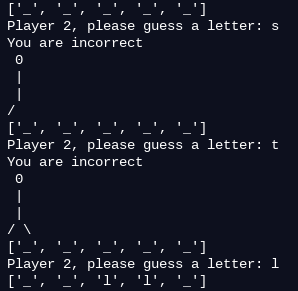

# Engineering_4_Notebook
Abby Paquette's Engineering 4 Notebook

## Hello Raspberry Pi
This was my first time ever using a raspberry pi, but this was really just a simple intro assignment. The raspberry pi is a computer, and all it needs is a keyboard, mouse, and monitor to be usable. The biggest hurdle was getting the raspberry pi connected to my computer, but I found that oftentimes a little patience goes a long way and if you wait for the light on the raspberry pi to be completely stable, it will usually work well. Once connected to the computer, I just talked to the pi over serial in a terminal like setting. Then, I ran code that printed hello world 10 times.

[Hello World Code](Python/hello_world.py)
 

## Get Your Pi Online
The goal of this assignment was fairly simple, to get my pi connected to the internet. Aside from making sure all the syntax was correct in the configuration page, the only part I found tricky was pushing changes I had made to github. I didn't have trouble cloning my repository to the raspberry pi, adding or committing changes, but when I went to push those changes (after I had typed in my email and username) I got a message saying that my repository had been corrupted, and I was no longer able to do any git commands. The way I fixed this was by deleting my repo and then re-cloning it back onto the pi from github.

## Hello Python
In this assignment I had to make a dice roller. The goal was that when the user pressed enter, they would recieve a random number between one and six, and when they pressed "x" and then enter, they would exit the program. This proved to be a fairly simple and short assignment, but it took me a while to get used to the programming environment. My biggest problem was figuring out how to take user input from the keyboard, but I was really just overcomplicating the issue. After looking at some example code, I learned that an easy way to do this is to make a variable that equals user input following some sort of command to the user. In my case that looked like: repeat = input("Press enter to roll or x and enter to quit."). Once you have your variable set to a specific value, you can use if statements to check and see if the user put in one of the specific things you were looking for, and run code based on that. Another new command that I learned is that you can put exit() in your code, and when it runs the program will end. Lastly, I learned how to power down the raspberry pi effectively and help lower the risk of your sd card being corrupted. The basic command for this is sudo shutdown (which shuts down after one minute), but you can also put -h and then a time like now.

[Hello Python Code](Python/dice_roller.py)

## Calculator
In this assignment I had to make a calculator using python. The goal was to make one function that did the math, and then run through that function five separate times, once for each operation (addition, subtraction, multiplication, division). The program also had to ask the user for the two numbers and receive that input, and print the solutions to the calculations.

The biggest thing I learned while making the calculator was the benefit of collaboration. For this program, I made the entire program in replit, a file sharing site, which allowed me to work at the same time as someone else on the code. This made testing and debugging so much faster, and two minds are almost always better than one. Again, the finished code was really pretty simple, but it involved using functions and getting used to the ideas of arguments and returns. The argument is what is sent to the function when it is called, in this case the numbers that the user inputted. The return is exactly what it sounds like, what the function returns to the place it was called (most often a loop). For the calculator, there were three parts of the argument, the first two were the numbers to do calculations with, and the third was a number from 1-5 that corresponded with what operation was supposed to happen. This is how we could run the same function 5 times and get the five different desired outputs. One other small tidbit I learned was how to round numbers, specifically in the division portion of this assignment. To round, put round in front of the number, and then at the end put a comma and the number of places you want the result to be rounded to.

[Calculator Code](Python/calculator.py)

 

## Quadratic Solver
This assignment was to make a program that found the roots of a quadratic. The requirements were:
- The program sends the three coefficients to a function 
- The function calculates the discriminant for the quadratic
- If the discriminant is negative, the user gets a message that there are no real roots
- If the discriminant is zero or positive, the function returns an array of the two roots. The program then prints the two roots. This occurs outside of the function.

Since I already understood how to use functions this time, the most complicated part of this assignment was the math. Additionally, returning the two roots in an array proved to be challenging because we had never used arrays before, and didn't have a solid grasp on what they did. For the quadratic solver I used repl.it again, and it was just as helpful this time. One feature that is super convenient on repl.it is that it is much easier to navigate the user interface than in beagleterm, especially in terms of moving the cursor and text wrapping. While this assignment felt a bit daunting at first, we looked at it one step at a time and started very simply, testing all along the way. All the program really does is take three user inputted numbers, send them to a function, and perform a bunch of math with those numbers. It was definitely a refresher in algebra, but if you just look at the quadratic formula, you can derive everything you need from it. Once we had all the requisite numbers, it was just a matter of returning the roots. That's where the new concept of arrays came in. An array is something that stores data so it can be accessed again. In our program, we put the numbers in brackets to return, which made it into an array. Because of that, later on in the loop, we were able to check and see if an array was used, and then know what type of discriminant there was. An array wasn't really necessary for this assignment, but it was a good introduction.

[Quadratic Solver Code](Python/quadratic_solver.py)

## Strings and Loops
For this assignment we had to splt apart a simple sentence. The letters in the sentence needed to printed one at a time with a dash (minus sign) at the end of each word. We did this assignment pretty quickly because, through a trial and error process, we stumbled upon a solution efficiently. Really all the code does is ask a user to input a sentence, make that sentence into a list, and then run a for loop. The for loop looks at the number of characters in the sentence, and runs through that number of times, printing one letter at a time and replacing the spaces with dashes. To do that, we used the replace() function.

[Strings and Loops Code](Python/strings_loops.py)

 

## MSP
This assignment was to make the traditional two player game of hangman -- or as we're now calling it: Man Shaped Piñata (MSP).

From the get go, this project seemed pretty complicated with a lot of moving parts to include. The multilayered aspect of the game with a few distinct chunks actually ended up making for a pretty simple division of labor and sequencing. We did a ton of psuedocoding and just writing down ideas for this program, and that turned out to be super beneficial. Roughly broken down, the sections of this would be: asking for user input, recognizing if the guessed letter exists in the word and where it is, putting the guessed letter into the list to be printed, and then printing the sections of the MSP that are needed. Taking and storing user input is pretty easy, as is recognizing whether or not the letter that player two guesses exists in the secret word. Even replacing a blank in the array with the letter didn't turn out to be too hard (once we figured out how to make a nice looking array of blanks), but figuring out what to do when there were multiple occurrences of the same letter in a word was very tricky. In the end, what we settled on was making an array of all the places that the letter appears in the word, and then running through a while loop that would look at those positions and then replace each blank in that position with the guessed letter. The other tricky part was figuring out how to print out the hangman person (MSP), but google (along with trial and error) is definitely your friend in this. At first we only gave the second player four guesses because we couldn't figure out how to split up characters that would be on the same line of the image (and thus the same element in the array), but we decided that that really was too few and not incredibly user friendly. By using commands such as pop (removes either the last element or a specified element), append (adds an element to the end), and insert (adds an element to a specified place), I was able to create an MSP that gave the user seven guesses and prints each piece of the body individually. The function I have for the MSP could definitely be improved upon, but it works well and isn't too redundant. The problem is that I don't yet know how to save the array that I make globally, so each time the function gets called and you re-enter it, it starts over with a fresh array. This is why there are greater than or equal signs for each number of wrong guesses in the MSP function.

Key takeaways are to break things down into small pieces and plan first (don't get overwhelmed or caught up in tiny details), try to collaborate when possible, and always use google to your advantage. Someone out there has solved the problem you are trying to solve and has so much knowledge they're willing to give.

[Man Shaped Piñata Code](Python/msp.py) -- Commented very thoroughly for reference and explanation of program

Here are pictures of the program in action. One example is a successful guessing attempt for the word elephant, and one is an unsuccessful round with hello.

       

## GPIO Pins - SSH
This assignment was to remotely blink an LED on and off with your pi using SSH (Secure Shell).

I found this assignment pretty quick and easy, but it was a bit tricky to get used to SSH and connecting wirelessly to my pi. The first thing I had to do was go into beagleterm and connect like usual, in order to find my pi's ip address. From there, all you have to do is put your pi's ip address into the Secure Shell, connect, and then you can unplug your pi (as long as you still power it somehow). For me, the biggest challenge was being able to connect to my pi more than once using ssh, because the pi's ip address kept changing. To fix this, I went into my wifi settings and reserved an ip address for my pi, that way everytime it boots up it will have this same static ip address. Once I could reliably connect, it was pretty simple to just write code that would make the led blink once each time it ran. This program uses GPIO (General Purpose Input Output) pins, which are a little confusing to figure out, but if you just google a diagram of the pins, you can find out what each pin is.

[GPIO Simple LED Blink Code](Python/led.py)

